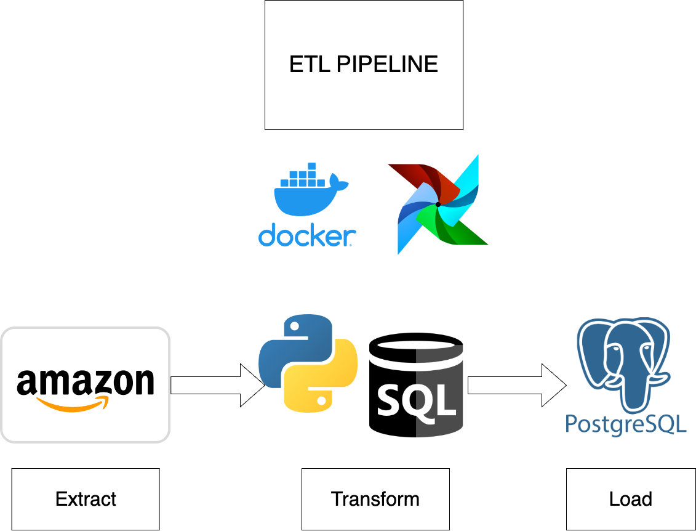

# Data Pipeline-Amazon Books
-----------

## Create a virtual environment and activate it (optional)
"""

    python -m venv venv
    source venv/bin/activate

"""

# 🔗Important links and Code
-----

## Install Airflow 
-----

Follow steps in the link - https://airflow.apache.org/docs/apache-airflow/stable/howto/docker-compose/index.html

# Pipeline Design

-----
-----
